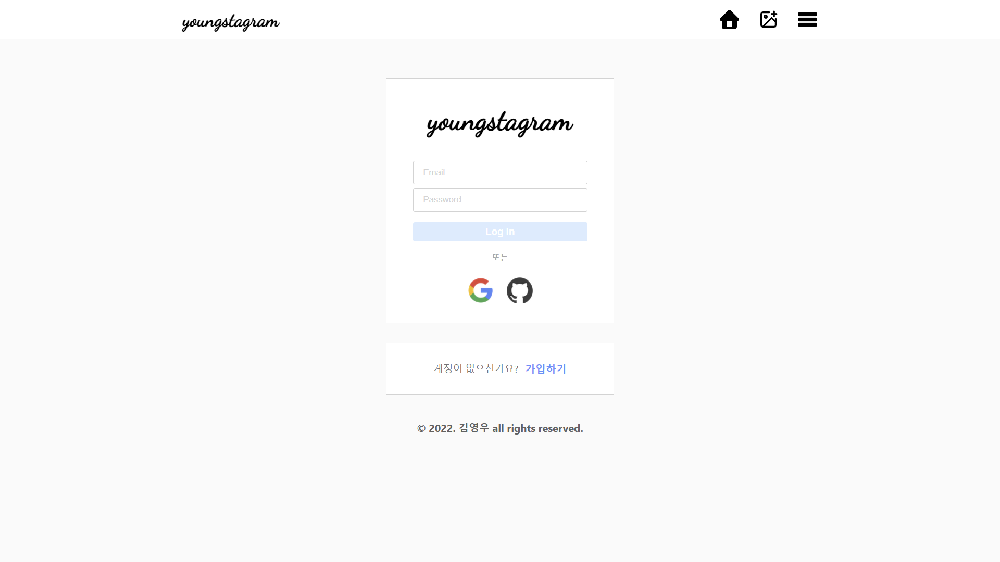
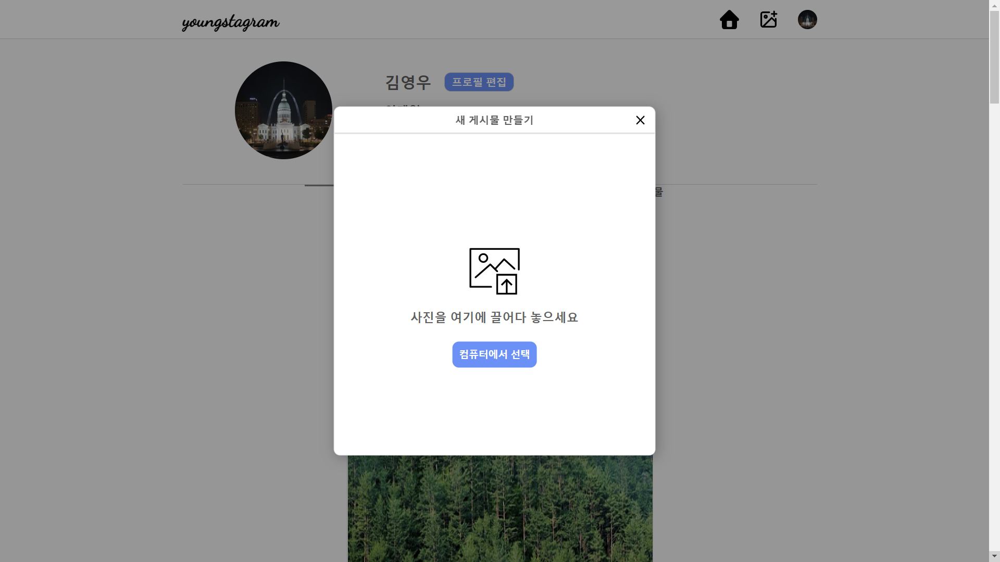
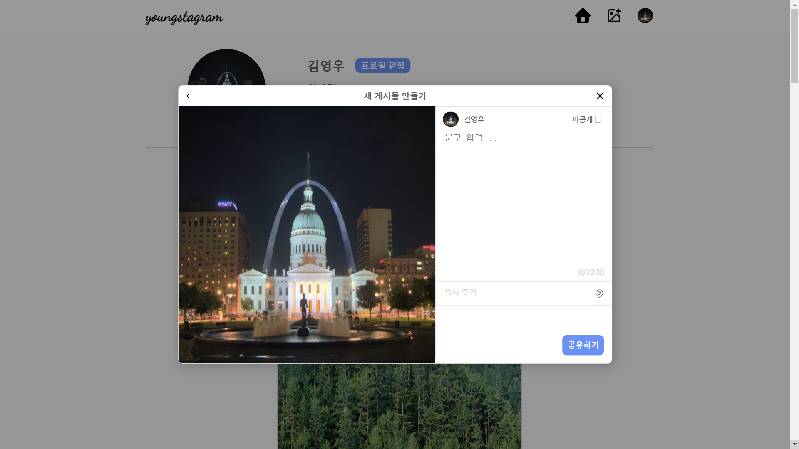
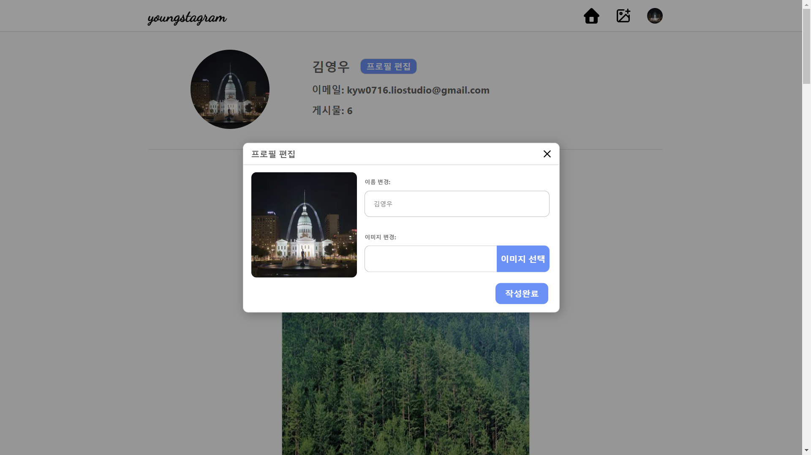
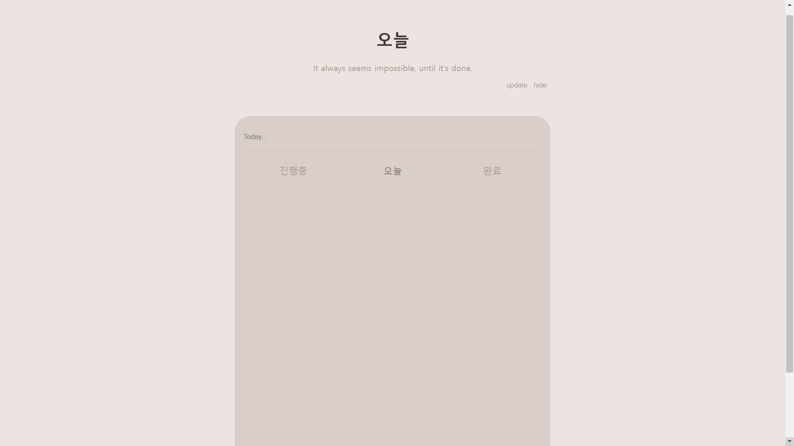
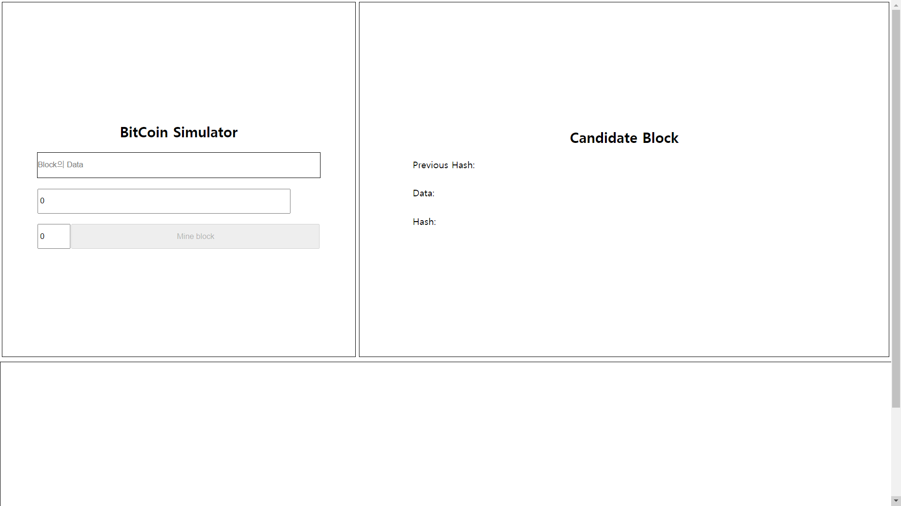
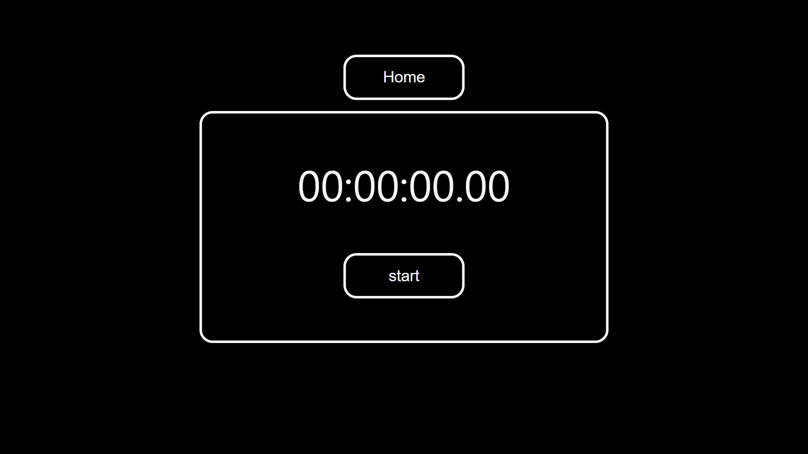
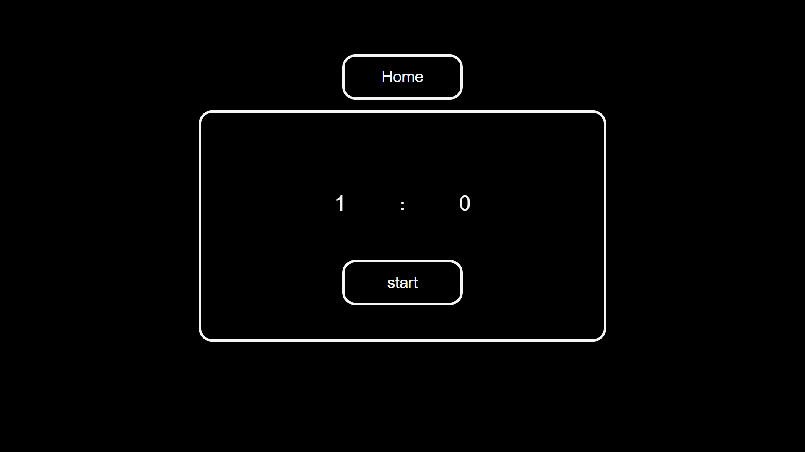

### It's <u>Young</u> time (´∀`)b

<!-- (출처: https://m.blog.naver.com/PostView.naver?isHttpsRedirect=true&blogId=furriky&logNo=220664635614) -->

 

🌱 I’m currently studying

 
 

### 📖 Tech Stack

  

 

### 💻 Deploy Sites

 

[https://youngstagram-demo.vercel.app](https://youngstagram-demo.vercel.app)

 
 

[https://plan-today.netlify.app/](https://plan-today.netlify.app/)

 
 

[https://coin-mining-simulator.netlify.app/](https://coin-mining-simulator.netlify.app/)

 
 

[https://kyw0716.github.io/Stopwatch-online/](https://kyw0716.github.io/Stopwatch-online/)

