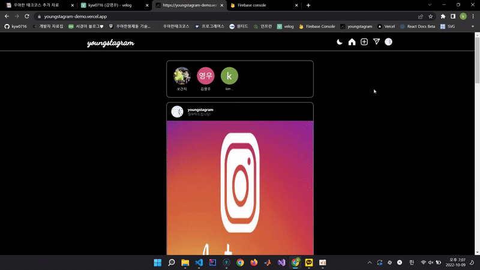
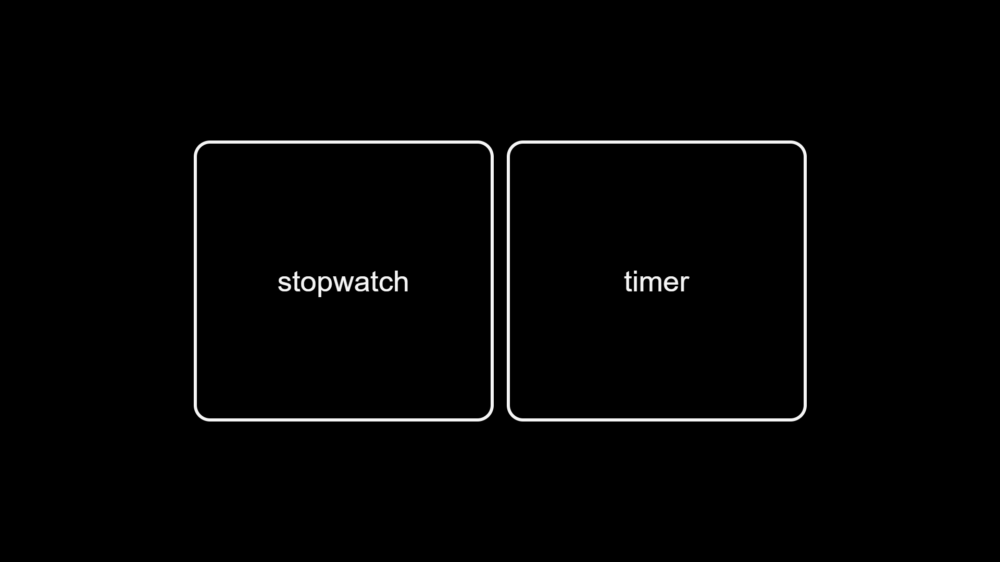

## It's <u>Young</u> time (´∀`)b

 

<!-- (출처: https://m.blog.naver.com/PostView.naver?isHttpsRedirect=true&blogId=furriky&logNo=220664635614) -->

 
 

# 📖 Tech Stack

 

 

# 💻 Deploy Sites

### [Youngstagram](https://youngstagram-demo.vercel.app)

##### 백엔드 개발자 없이 인스타그램 웹서비스를 구현해보기 위해 시작한 프로젝트 (진행중)

> ##### 현재 구현된 기능 : 로그인, 회원가입, 프로필 등록/수정, 이미지 등록, 이미지 공개/비공개 설정, 댓글 등록/수정, 이미지 수정, 좋아요, 팔로우/팔로잉 등록, DM
>
> ##### 앞으로 구현 할 기능 : 유저 검색 기능

##### 참고 : [Youngstagram repository](https://github.com/kyw0716/Youngstagram)

 

### - 로그인 기능

 

### - 프로필 편집 기능

 

### - 이미지 업로드 기능

 

### - 댓글 기능

 

### - 팔로우 기능

 

### - DM 기능

 

### - 다크모드 기능

 
 

### [PlanToday](https://plan-today.netlify.app/)

##### React를 사용해 실제로 사용할 수 있는 시간관리 웹앱을 만들어보기 위해 시작한 프로젝트 (완료)

> ##### 구현된 기능: localstorage를 활용해 db를 사용하지 않고 할일을 등록/수정/삭제, 할일을 진행중 오늘 완료의 상태로 구분지어 렌더링, 명언 API 사용
>
> ##### 완료까지 걸린 시간: 2주

##### 참고 : [PlanToday repository](https://github.com/kyw0716/planToday)

 

 
 

### [Coin Simulator](https://coin-mining-simulator.netlify.app/)

##### 코인 채굴하는 방식의 이해를 돕기 위해 간단한 코인 채굴 시뮬레이터를 만들어 보고자 시작한 프로젝트 (완료)

> ##### 구현된 기능: sha256을 사용한 해싱, 자동 Nonce 산출, 생성된 블럭 렌더링
>
> ##### 완료까지 걸린 시간: 3일

##### 참고 : [Coin Simulator repository](https://github.com/kyw0716/block-chain)

 

 
 

### [StopWatch + Timer](https://kyw0716.github.io/Stopwatch-online/)

##### 토익을 준비하던 여자친구가 온라인 스톱워치를 사용하는 것을 보고 광고 없는 스톱워치를 만들어 주고자 시작한 프로젝트 (완료)

> ##### 구현된 기능: setinterv, setTimout을 활용해 시간을 재는 기능, 웹에서 실행시 타이머 소리가 나오는 기능
>
> ##### 완료까지 걸린 시간 : 1일

##### 참고 : [StopWatch + Timer](https://github.com/kyw0716/Stopwatch-online)

 

